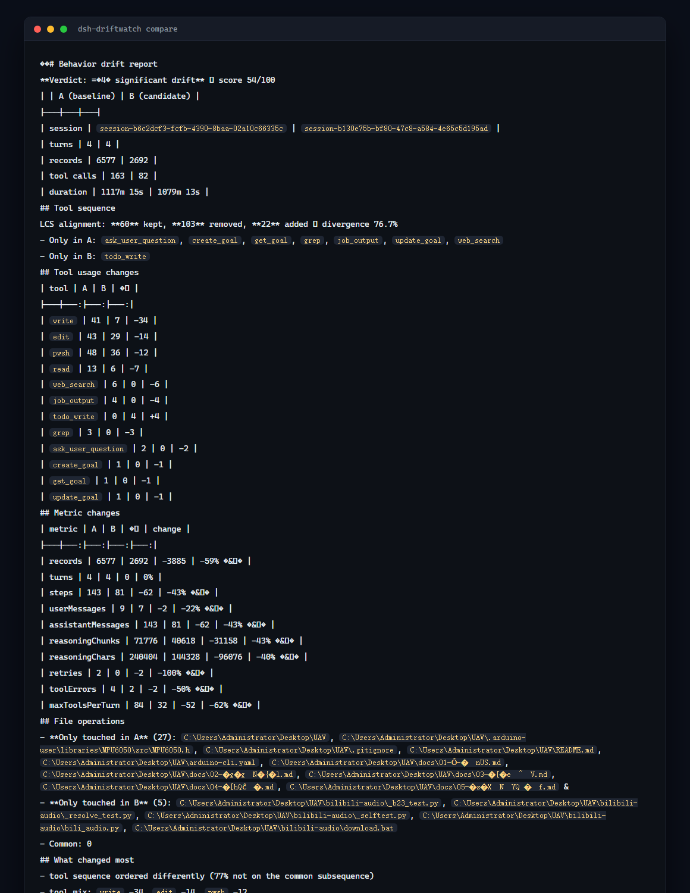
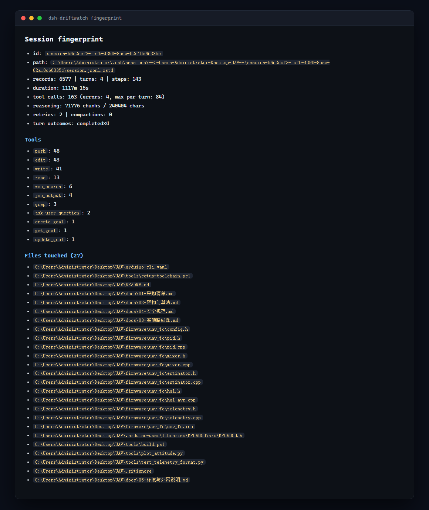
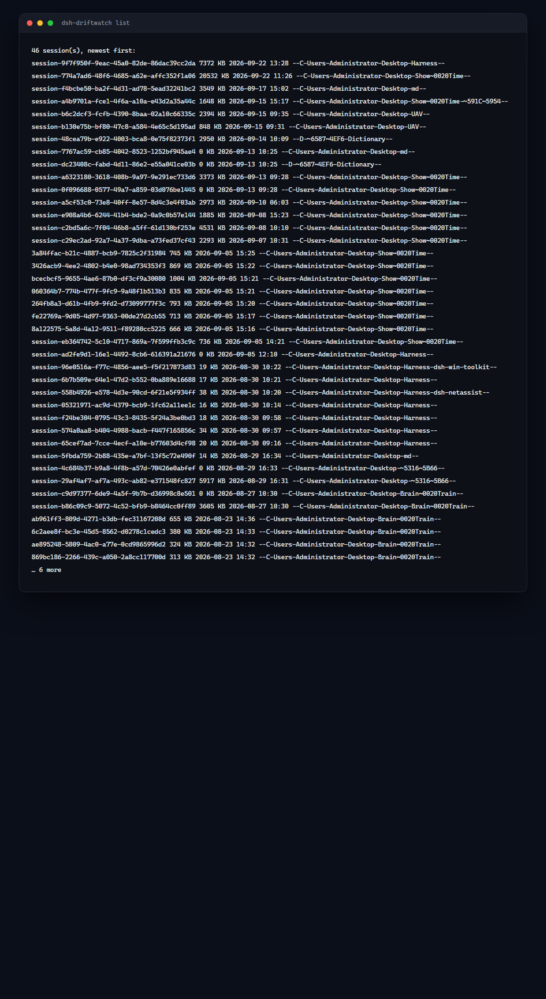

# dsh-driftwatch


> Part of the **dsh-toolkit family**: [dsh-mcp-bridge](https://github.com/Edge-Echo/dsh-mcp-bridge) · [dsh-win-toolkit](https://github.com/Edge-Echo/dsh-win-toolkit) · [dsh-netassist](https://github.com/Edge-Echo/dsh-netassist) · [dsh-driftwatch](https://github.com/Edge-Echo/dsh-driftwatch) · [mcp-netassist](https://github.com/Edge-Echo/mcp-netassist) · [dsh-ledger](https://github.com/Edge-Echo/dsh-ledger)

[](https://www.npmjs.com/package/dsh-driftwatch)
[](https://www.npmjs.com/package/dsh-driftwatch)
[](LICENSE)

**Behavior-drift reports for [DeepSeek Harness](https://github.com/deepseek-ai/deepseek-harness) agents.**

You changed a prompt, a plugin, or a model. Something feels different. But *what* changed — and by how much?

DriftWatch reads two session logs and tells you exactly how the agent's behavior diverged: tool-call sequence, tool mix, file targets, reasoning volume, retries, timing. Zero dependencies. CI-ready.

> 中文文档见 [README.zh.md](README.zh.md)。

## The problem

DSH logs everything (`Model-visible means logged`), so the evidence already exists — but reading a 59 MB trajectory by hand is not a workflow. Existing tools solve adjacent problems:

| Tool | Answers |
|---|---|
| `dsh-replay` | "show me this trajectory" (debugging) |
| `dsh-eval-harness` | "does this match my written expectations?" (assertions) |
| `dsh-session-snapshot` | "record this session so tests can rely on it" (fixtures) |
| `dsh-windtunnel` | "replay the pipeline with a scripted model" (deterministic contracts) |
| **`dsh-driftwatch`** | **"how does this run differ from that run?" (comparison)** |

`dsh-replay` diffs trajectories for debugging; `dsh-eval-harness` gates on assertions written in
advance. Neither answers the question in between: *this run took a different path — is that a
problem?* DriftWatch deliberately does **not** assert and does **not** render trajectories. It
produces a *drift report*: a structured, reviewable statement of behavioral change, plus an
optional threshold gate for CI.

## What it looks like







## Quick start

```sh
# list sessions under $DSH_HOME/sessions
npx dsh-driftwatch list

# compare two runs (id, id prefix, or path)
npx dsh-driftwatch compare session-b6c2dcf3 session-b130e75b

# CI gate: fail when drift reaches 35/100
npx dsh-driftwatch compare before after --fail-on-drift 35 --markdown drift.md
```

Real output from two actual runs:

```
**Verdict: 🔴 significant drift** — score 54/100

| | A (baseline) | B (candidate) |
|---|---|---|
| turns | 4 | 4 |
| records | 6577 | 2692 |
| tool calls | 163 | 82 |
| duration | 1117m 15s | 1079m 13s |

## Tool usage changes
| tool | A | B | Δ |
|---|---:|---:|---:|
| `write` | 41 | 7 | -34 |
| `edit` | 43 | 29 | -14 |
| `pwsh` | 48 | 36 | -12 |
| `todo_write` | 0 | 4 | +4 |
```

## What it measures

| Signal | Detail | Weight |
|---|---|---|
| Tool sequence | LCS alignment: kept / removed / added, divergence % | 40% |
| Tool mix | per-tool count deltas across both runs | 25% |
| Metrics | records, turns, steps, messages, reasoning chunks/chars, compactions, retries, tool errors, max tools per turn | 20% |
| File targets | paths touched in only A / only B / both | 15% |

Those weights combine into a **0–100 drift score** with three tiers: `stable` (<10), `moderate` (10–34), `significant` (≥35).

DriftWatch never decides whether drift is *acceptable* — that judgment stays with you. The score and thresholds are just a way to make the change visible.

## CI integration

```yaml
# .github/workflows/drift.yml
- name: Behavior drift check
  run: |
    npx dsh-driftwatch compare "$BASELINE_SESSION" "$CANDIDATE_SESSION" \
      --fail-on-drift 35 --markdown drift-report.md
- uses: actions/upload-artifact@v4
  if: always()
  with:
    name: drift-report
    path: drift-report.md
```

`--json` emits the full machine-readable report (scores, deltas, file sets) for dashboards or PR bots.

## As a dsh plugin

Installing it into a profile also gives the agent two tools:

```sh
dsh plugin --profile web add dsh-driftwatch
```

| Tool | What the agent can do |
|---|---|
| `drift_compare` | compare two sessions and report the drift inline |
| `drift_list` | list available sessions to pick a baseline |

Useful for "compare how you did this task this time vs last time" — the agent gathers its own evidence.

## How the session log is read

DSH session logs are append-only `.jsonl.zstd`: every append is a separate zstd frame, so a log is a concatenation of frames. Node's zlib decodes only the first frame and its stream API rejects the rest; DSH itself relies on a private zstd handle plus a koffi FFI fallback.

DriftWatch builds on **[`@edge-echo/dsh-ledger`](https://github.com/Edge-Echo/dsh-ledger)**, which parses the zstd frame structure (RFC 8878) instead of decompressing: 34,729 frames are located in **27 ms**, without decoding a byte, and boundaries are exact rather than recovered by retrying.

The frame walk used to live here as a magic-scan heuristic, so the same subtle format was implemented twice. It now lives in one place, and the swap was checked rather than assumed: over a frozen 20 MiB log the old and new decoders produce the **identical 62,037,223-character payload and the same 53,671 records**. The structural walk costs about 17% more CPU in this path (overall time is dominated by zstd decoding, not by finding boundaries) — the win is exactness and one implementation, not throughput.

That is the project's only runtime dependency, and it is itself dependency-free: **no third-party runtime code** ships in either package.

## Limitations

- Session-log record types are read defensively: unknown types are ignored, missing fields are tolerated. A future format change degrades the report rather than crashing it.
- Sequence alignment is exact (LCS) up to 4 M cell pairs; beyond that it falls back to multiset overlap and says so in the report.
- DriftWatch compares *behavior*, not *correctness*. A stable run can be wrong; a drifting run can be better.

## License

MIT
